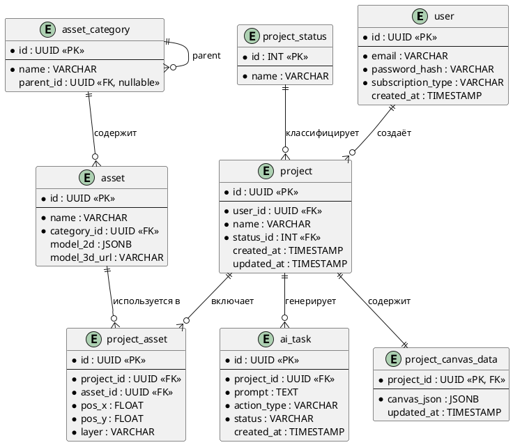

# ERD — Проектирование базы данных

## Ключевые связи и обоснование решений

### Пользователи и Проекты (user → project)

**Тип связи:** 1:N (один ко многим)

**Обоснование:** Один пользователь может создать сколько угодно планов квартир, но каждый план принадлежит строго одному автору. Внешний ключ `user_id` хранится в таблице `project`.

**Выбор UUID вместо SERIAL:** В физической модели используется тип `UUID` вместо обычных чисел. Если бы ID был равен `123`, злоумышленник мог бы подставить `124` в адресную строку и украсть чужой чертёж. UUID угадать невозможно.

---

### Расстановка мебели на плане (project ↔ asset)

**Тип связи:** M:N (многие ко многим), разрешённая через таблицу `project_asset` (Паттерн L1)

**Обоснование:** Один и тот же стул (из каталога `asset`) может использоваться в сотнях проектов. И в одном проекте могут стоять десятки разных стульев.

**Зачем нужна промежуточная таблица:** `project_asset` не только связывает проект и объект, но и хранит атрибуты самой связи: координаты `pos_x`, `pos_y` и слой (электрика/мебель).

---

### Иерархия каталога объектов (asset_category)

**Тип связи:** 1:N (петля). Паттерн L4.

**Обоснование:** Каталог мебели и коммуникаций — это дерево (папки). Например:
```
Инженерные системы
└── Водоснабжение
    └── Трубы
        └── ПВХ трубы
```
Вместо того чтобы создавать таблицы `category_level_1`, `category_level_2` (и ломать базу при добавлении третьего уровня), добавлено поле `parent_id`, которое ссылается на ту же таблицу. Если `parent_id = NULL` — это корневая папка.

---

### Интеграция с нейросетью (project → ai_task)

**Тип связи:** 1:N (один ко многим)

**Обоснование:** Пользователь, работая над одним проектом, может отправлять множество запросов ИИ. Нам нужно хранить всю историю для очереди RabbitMQ и для аналитики.

---

### Разделение тяжёлых данных (project → project_canvas_data)

**Тип связи:** 1:1 (один к одному). Паттерн P1 (выделение «горячих» данных).

**Обоснование:** В таблице `project` хранится лёгкая мета-информация (название, дата, автор). Весь нарисованный план со стенами может весить много мегабайт. Когда пользователь заходит на дашборд, база должна мгновенно отдать список проектов без загрузки тяжёлых данных холста.

Сам чертёж хранится в формате **JSONB**, так как его структура может гибко меняться.

---

## ERD-диаграмма



:::info
Для отображения PlantUML-диаграммы необходим плагин [docusaurus-plugin-plantuml](https://github.com/akebifiky/remark-simple-plantuml) или интеграция с PlantUML-сервером.
:::
