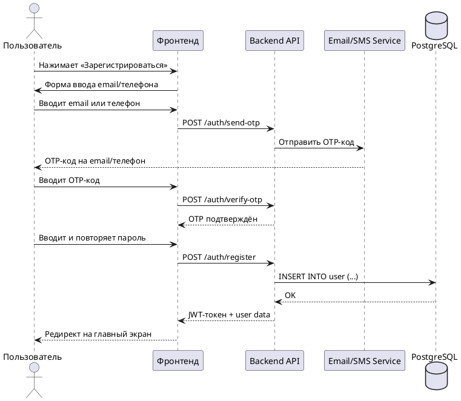
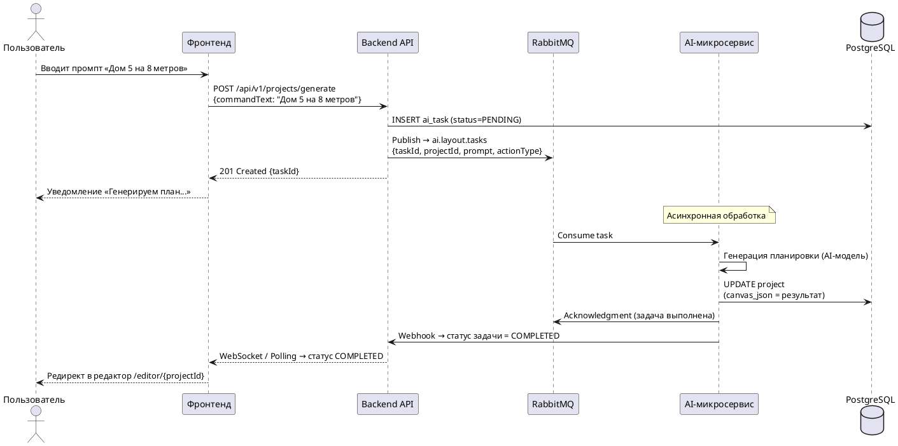
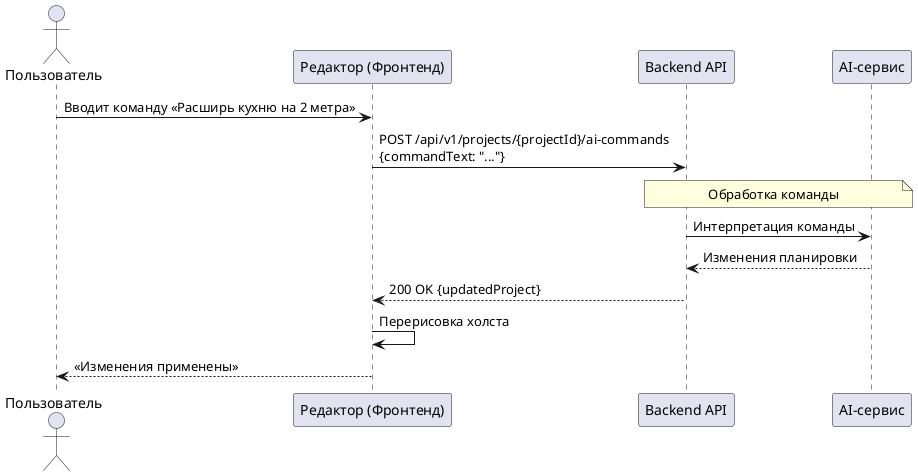

# Sequence-диаграммы

## SD-01: Регистрация пользователя (UC-01)

---

## SD-02: Создание проекта через AI (UC-04, Асинхронная генерация)

---

## SD-03: Отправка AI-команды в редакторе (UC-04, Синхронный путь)

:::note Шаблон
Этот раздел требует доработки. Описать поток для синхронных команд редактирования через чат AI-помощника.
:::

:::info
Для отображения PlantUML-диаграмм необходим плагин [docusaurus-plugin-plantuml](https://github.com/akebifiky/remark-simple-plantuml).
:::
